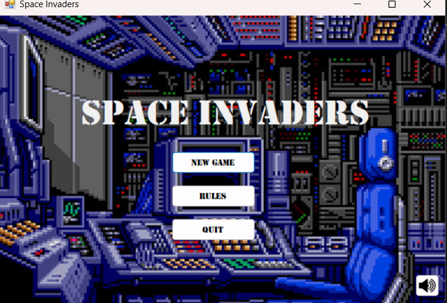
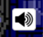
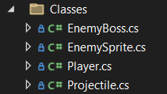
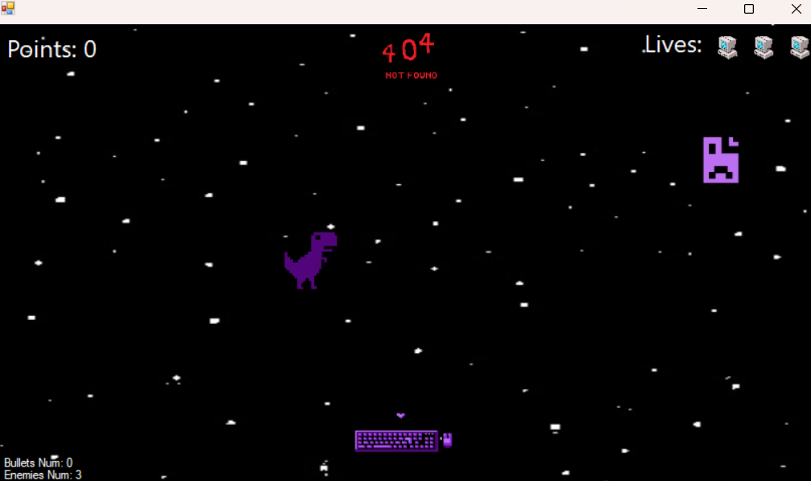

# Space Invaders 
Windows Forms Project by: Katerina Bogojoska and Teodor Angeleski

Македонски 
1. **Опис на апликацијата** \
	Апликацијата што ја развивавме е слична со класичната Space Invaders игра со мали промени. Наместо да се бори свемирски брод со вонземјани, направивме тастатура да се бори против компјутерски багови.

2. **Упатство за користење**
    1. Започнување нова игра:
		Започнување на нова игра може да се направи со кликање на копчето “New Game” на Main Menu формата што ќе се отвори
	2. Исклучување на апликацијата
		Ова се прави преку копчето “Quit” каде следно ќе се појави прозорче за потврдување на акцијата.
	3. Правила на игра:
		Правилата на играта ги има во самата апликација, и може да се пристапи до нив со кликање на копчето “Rules”: 
         

	Правилата се прилично стандардни за некој ваков тип на игра:  
    * Ако непријател успее да ја помине тастатурата и да навлезе во нејзината територија (позади играчот/тастатурата) без да биде погоден со проектил, играчот губи еден од трите животи.
    * Со секое соборување на непријател играчот добива по 10 поени.
    * Кога ќе успее да стигне до 150 поени на играчот му се појавува следната препрека односно “Boss bug”. Овој непријател има 10 животи и пука кон играчот.
    * Ако играчот е погоден од страна на Boss-от, играчот губи еден живот.
    * Играта се губи ако играчот ги изгуби сите три животи.
    * Играта се победува ако играчот успее да освои 150 поени и да го победи Boss-от.
    4. Музика
	При вклучување на апликацијата има default музика која моѓе да се исклучи/вклучи при кликање на копчето во долниот десен агол. \
    
			                             
    5. Копчиња за управување
	→ - за движење на тастатурата која пука надесно \
    ← - за движење на тастатурата кој пука налево \
    Space – за пукање проектили

3. **Претставување на проблемот**
	1. Податочни структури \
		За зачувување на одредени актери во играта и нивни функционалности ги креиравме следниве стандардни класи: 

        
		
	```csharp
    public class EnemyBoss {
        // Represent the enemy
        public PictureBox image;
        // Store image frames for animation
        private List<Image> frames = new List<Image>() {
            new Bitmap(Resources.boss_1),
            new Bitmap(Resources.boss_2),
            new Bitmap(Resources.boss_3)
        };
        // Private counter for looping through frames
        private int currentFrame = 1;

        public bool direction = false; // flag for moving right/left
        public bool moveDown { get; set; } // flag for moving up/down

        public EnemyBoss(Point center) { // Draw enemy at point provided from argument
            image = new PictureBox() {
                Image = new Bitmap(Resources.boss_1),
                Size = new Size(150, 150),
                SizeMode = PictureBoxSizeMode.StretchImage,
                Location = center,
                BackColor = Color.Transparent
            };
            moveDown = true;
        }

        // Switch boss' direction upon hitting edge of screen
        public void switchDirection() {
            direction = !direction;
        }

        // Methods for moving boss, update position
        public void moveHorizontal() {
            Point pos = image.Location;
            pos.X += direction ? 7 : -7; // Move right/left depending on direction
            image.Location = pos;
        }

        public void moveVertical() {
            Point pos = image.Location;
            // Check whether boss reached height bounds for up/down
            if (moveDown) {
                if (pos.Y + image.Height + 10 > 250)
                    moveDown = false;
                pos.Y += 10;
            } else {
                if (pos.Y - 10 < 50)
                    moveDown = true;
                pos.Y -= 10;
            }
            image.Location = pos;
        }

        // Loop through frames, method is called on timer1.tick()
        public void animate() {
            if (currentFrame == 1) {
                image.Image = frames[0];
                currentFrame++;
            } else if (currentFrame == 2) {
                image.Image = frames[1];
                currentFrame++;
            } else {
                image.Image = frames[2];
                currentFrame = 1;
            }
        }
    }
    ```
    На сличен начин се другите класи напишани, користејќи `PictureBox` за претстава на објектот

	2. Форми \
		За креирање на играва ни беа потребни 3 форми: една како главно мени која ги содржи функционалностите за креирање нова игра, преглед на правила и излез од апликацијата, форма за самиот приказ на правилата, и форма за самата игра.
	3. Функционалности на играта 
		

		На самата форма во левиот горен агол на играчот му се прикажани поените кои ги има освено во секој момент, во десниот горен агол се животите кои се останати, додека пак во долниот лев агол се бројот на непријатели на сцената и бројот на проектили моментално. 

    Функционалности: 
    * Придвижување на играчот и пукање проектили.
    * Посебна метода за отчукувањата на тајмерот според кој додаваме непријатели на сцената, променуваме позадина на одредени интервали, овозможуваме појава на Boss,како и други проверки.

    ```csharp
    private void timer1_Tick(object sender, EventArgs e) {
            timerTicks++;

            // Spawn enemies untill point threshold is reached
            if (playerPoints < 150 && timerTicks % 20 == 0) spawnEnemies();
            if (playerPoints >= 150 && !bossSpawned) { 
                spawnBoss();
                bossSpawned = true;
                removeAllCurrentProjectiles();
                projectiles.Clear();
                showBossLifeBar(true);
            }

            if (timerTicks % 40 == 0) changeBG();

            if (bossSpawned) {
                removeEnemySprites();
                boss.moveHorizontal();
                if (timerTicks % 25 == 0) boss.moveVertical();
                if (timerTicks % 20 == 0) bossAttack();
                if (timerTicks % 10 == 0) boss.animate();

                if (checkBoundsToSwapDirection()) {
                    boss.switchDirection();
                }
                checkIfBossHitPlayer();
                checkIfPlayerHitBoss();
            }

            movePlayer();
            moveUnits();

            bulletIsOutOfFrame();
            enemyIsOutOfFrame();
            checkHit();

            // Check if game ended
            if (onBossHits == 10) {
                bossDefeated = true;
                bossSpawned = false;
                Controls.Remove(boss.image);
            }
            if (mistakes == 3)
                endGame();
            if (bossDefeated)
                gameWon();
        }
    ```


    * *checkHit()* проверка за дали одреден непријател е погоден со пректил или не
    * *enemyIsOutOfFrame()* проверка дали непијателот е надвор од сцената (помошна фунционалност за пресметка на животите кои се останати)
    * *spawnEnemies()* додавање непријатели на сцената
    * и многу други